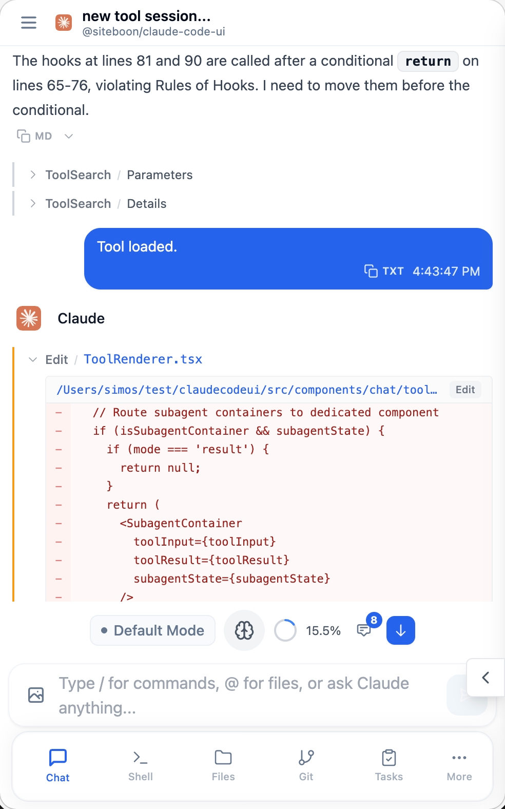

<div align="center">
  
  <h1>Cloud CLI（又名 Claude Code UI）</h1>
  <p><a href="https://docs.anthropic.com/en/docs/claude-code">Claude Code</a>、<a href="https://docs.cursor.com/en/cli/overview">Cursor CLI</a>、<a href="https://developers.openai.com/codex">Codex</a> 和 <a href="https://geminicli.com/">Gemini-CLI</a> 的桌面和行動裝置 UI。可在本機或遠端使用，從任何地方查看您的專案與工作階段。</p>
</div>

<p align="center">
  <a href="https://cloudcli.ai">CloudCLI Cloud</a> · <a href="https://cloudcli.ai/docs">文件</a> · <a href="https://discord.gg/buxwujPNRE">Discord</a> · <a href="https://github.com/siteboon/claudecodeui/issues">Bug 回報</a> · <a href="CONTRIBUTING.md">貢獻指南</a>
</p>

<p align="center">
  <a href="https://cloudcli.ai"></a>
  <a href="https://discord.gg/buxwujPNRE"></a>
  <br><br>
  <a href="https://trendshift.io/repositories/15586" target="_blank"></a>
</p>

<div align="right"><i><a href="./README.md">English</a> · <a href="./README.ru.md">Русский</a> · <a href="./README.de.md">Deutsch</a> · <a href="./README.ko.md">한국어</a> · <a href="./README.zh-CN.md">简体中文</a> · <b>繁體中文</b> · <a href="./README.ja.md">日本語</a> · <a href="./README.tr.md">Türkçe</a></i></div>

---

## 截圖

<div align="center">

<table>
<tr>
<td align="center">
<h3>桌面檢視</h3>

<br>
<em>顯示專案總覽和聊天的主介面</em>
</td>
<td align="center">
<h3>行動裝置體驗</h3>

<br>
<em>具有觸控導覽的響應式行動裝置設計</em>
</td>
</tr>
<tr>
<td align="center" colspan="2">
<h3>CLI 選擇</h3>

<br>
<em>在 Claude Code、Gemini、Cursor CLI 與 Codex 之間進行選擇</em>
</td>
</tr>
</table>

</div>

## 功能

- **響應式設計** — 在桌面、平板和行動裝置上無縫運作，讓您隨時隨地使用 Agents
- **互動聊天介面** — 內建聊天 UI，輕鬆與 Agents 交流
- **整合 Shell 終端機** — 透過內建 shell 功能直接存取 Agents CLI
- **檔案瀏覽器** — 互動式檔案樹，支援語法醒目提示與即時編輯
- **Git 瀏覽器** — 檢視、暫存並提交變更，還可切換分支
- **工作階段管理** — 恢復對話、管理多個工作階段並追蹤歷史紀錄
- **外掛系統** — 透過自訂分頁、後端服務與整合來擴充 CloudCLI。[開始建構 →](https://github.com/cloudcli-ai/cloudcli-plugin-starter)
- **TaskMaster AI 整合** *(選用)* — 結合 AI 任務規劃、PRD 分析與工作流程自動化，實現進階專案管理
- **模型相容性** — 支援 Claude、GPT、Gemini 模型家族（完整支援列表可透過 `GET /api/providers/:provider/models` 介面取得）

## 快速開始

### CloudCLI Cloud（推薦）

無需本機設定即可快速啟動。提供可透過網路瀏覽器、行動應用程式、API 或慣用的 IDE 存取的完全容器化託管開發環境。

**[立即開始 CloudCLI Cloud](https://cloudcli.ai)**

### 自架（開源）

#### npm

啟動 CloudCLI UI，只需一行 `npx`（需要 Node.js v22+）：

```bash
npx @cloudcli-ai/cloudcli
```

或進行全域安裝，便於日常使用：

```bash
npm install -g @cloudcli-ai/cloudcli
cloudcli
```

開啟 `http://localhost:3001`，系統會自動發現所有現有工作階段。

更多設定選項、PM2、遠端伺服器設定等，請參閱 **[文件 →](https://cloudcli.ai/docs)**。

#### Docker Sandboxes（實驗性）

在隔離的沙箱中執行代理，具有虛擬機管理程式等級的隔離。預設啟動 Claude Code。需要 [`sbx` CLI](https://docs.docker.com/ai/sandboxes/get-started/)。

```bash
npx @cloudcli-ai/cloudcli@latest sandbox ~/my-project
```

支援 Claude Code、Codex 和 Gemini CLI。詳情請參閱[沙箱文件](docker/)。

---

## 哪個選項更適合你？

CloudCLI UI 是 CloudCLI Cloud 的開源 UI 層。你可以在本機上自架它，也可以使用提供團隊功能與深入整合的 CloudCLI Cloud。

| | CloudCLI UI（自架） | CloudCLI Cloud |
|---|---|---|
| **適合對象** | 需要為本機代理工作階段提供完整 UI 的開發者 | 需要部署在雲端，隨時從任何地方存取代理的團隊與開發者 |
| **存取方式** | 透過 `[yourip]:port` 在瀏覽器中存取 | 瀏覽器、任意 IDE、REST API、n8n |
| **設定** | `npx @cloudcli-ai/cloudcli` | 無需設定 |
| **機器需保持開機嗎** | 是 | 否 |
| **行動裝置存取** | 網路內任意瀏覽器 | 任意裝置（原生應用程式即將推出） |
| **可用工作階段** | 自動發現 `~/.claude` 中的所有工作階段 | 雲端環境內的工作階段 |
| **支援的 Agents** | Claude Code、Cursor CLI、Codex、Gemini CLI | Claude Code、Cursor CLI、Codex、Gemini CLI |
| **檔案瀏覽與 Git** | 內建於 UI | 內建於 UI |
| **MCP 設定** | UI 管理，與本機 `~/.claude` 設定同步 | UI 管理 |
| **IDE 存取** | 本機 IDE | 任何連線到雲端環境的 IDE |
| **REST API** | 是 | 是 |
| **n8n 節點** | 否 | 是 |
| **團隊共享** | 否 | 是 |
| **平台費用** | 免費開源 | 起價 $7/月 |

> 兩種方式都使用你自己的 AI 訂閱（Claude、Cursor 等）— CloudCLI 提供環境，而非 AI。

---

## 安全與工具設定

**🔒 重要提示**：所有 Claude Code 工具預設**停用**，可防止潛在的有害操作自動執行。

### 啟用工具

1. **開啟工具設定** — 點擊側邊欄齒輪圖示
2. **選擇性啟用** — 僅啟用所需工具
3. **套用設定** — 偏好設定儲存在本機

<div align="center">


*工具設定介面 — 只啟用你需要的內容*

</div>

**建議做法**：先啟用基礎工具，再根據需要新增其他工具。隨時可以調整。

---

## 外掛

CloudCLI 配備外掛系統，允許你新增帶有自訂前端 UI 和選用 Node.js 後端的分頁。在 Settings > Plugins 中直接從 Git 儲存庫安裝外掛，或自行開發。

### 可用外掛

| 外掛 | 描述 |
|---|---|
| **[Project Stats](https://github.com/cloudcli-ai/cloudcli-plugin-starter)** | 展示目前專案的檔案數、程式碼行數、檔案類型分佈、最大檔案以及最近修改的檔案 |
| **[Web Terminal](https://github.com/cloudcli-ai/cloudcli-plugin-terminal)** | 支援多分頁的完整 xterm.js 終端機 |
| **[Claude Watch](https://github.com/satsuki19980613/cloudcli-claude-watch)** | 監控長時間執行的 Claude Code 工作階段是否卡住，並提供程序控制 |
| **[CloudCLI Scheduler](https://github.com/grostim/cloudcli-cron)** | 建立工作區範圍的排程提示詞，並透過 Codex、Claude Code 或 Gemini CLI 等本機 CLI 執行 |
| **[PRISM CloudCLI](https://github.com/jakeefr/cloudcli-plugin-prism)** | 在 CloudCLI 中提供 Claude Code 工作階段智慧分析，包括 token 消耗可視化 |
| **[Sessions](https://github.com/strykereye2/cloudcli-plugin-session-manager)** | 檢視、管理並終止作用中的 Claude Code 工作階段 |
| **[Token Cost Calculator](https://github.com/NightmareAway/cloudcli-plugin-token-cost-calculator)** | 根據模型價格與 token 用量計算 API 成本，並支援模型價格預設 |
| **[Task Queue](https://github.com/TadMSTR/cloudcli-plugin-task-queue)** | 用於檢視、篩選和啟動代理任務的任務佇列儀表板 |
| **[GitHub Issues Board](https://github.com/szmidtpiotr/claude-github-issue)** | 用於 GitHub Issues 的看板，支援 TaskMaster 雙向同步和 /github-task CLI 技能自動安裝 |

### 自行建構

**[Plugin Starter Template →](https://github.com/cloudcli-ai/cloudcli-plugin-starter)** — Fork 該儲存庫以建構自己的外掛。範例包括前端渲染、即時上下文更新和 RPC 通訊。

**[外掛文件 →](https://cloudcli.ai/docs/plugin-overview)** — 提供外掛 API、清單格式、安全模型等完整指南。

---

## 常見問題

<details>
<summary>與 Claude Code Remote Control 有何不同？</summary>

Claude Code Remote Control 讓你傳送訊息到本機終端機中已經執行的工作階段。該方式要求你的機器保持開機，終端機保持開啟，中斷網路後約 10 分鐘工作階段會逾時。

CloudCLI UI 與 CloudCLI Cloud 是對 Claude Code 的擴充，而非旁觀 — MCP 伺服器、權限、設定、工作階段與 Claude Code 完全一致。

- **涵蓋全部工作階段** — CloudCLI UI 會自動掃描 `~/.claude` 資料夾中的每個工作階段。Remote Control 只暴露目前活動的工作階段。
- **設定統一** — 在 CloudCLI UI 中修改的 MCP、工具權限等設定會立即寫入 Claude Code。
- **支援更多 Agents** — Claude Code、Cursor CLI、Codex、Gemini CLI。
- **完整 UI** — 除了聊天介面，還包括檔案瀏覽器、Git 整合、MCP 管理和 Shell 終端機。
- **CloudCLI Cloud 持續運作於雲端** — 關閉本機裝置也不會中斷代理執行，無需監控終端機。

</details>

<details>
<summary>需要額外購買 AI 訂閱嗎？</summary>

需要。CloudCLI 只提供環境。你仍需自行取得 Claude、Cursor、Codex 或 Gemini 訂閱。CloudCLI Cloud 從 $7/月起提供託管環境。

</details>

<details>
<summary>能在手機上使用 CloudCLI UI 嗎？</summary>

可以。自架時，在你的裝置上執行伺服器，然後在網路中的任意瀏覽器開啟 `[yourip]:port`。CloudCLI Cloud 可從任意裝置存取，內建原生應用程式也在開發中。

</details>

<details>
<summary>UI 中的變更會影響本機 Claude Code 設定嗎？</summary>

會的。自架模式下，CloudCLI UI 讀取並寫入 Claude Code 使用的 `~/.claude` 設定。透過 UI 新增的 MCP 伺服器會立即在 Claude Code 中可見。

</details>

---

## 社群與支援

- **[文件](https://cloudcli.ai/docs)** — 安裝、設定、功能與疑難排解指南
- **[Discord](https://discord.gg/buxwujPNRE)** — 取得協助並與社群交流
- **[GitHub Issues](https://github.com/siteboon/claudecodeui/issues)** — 回報 Bug 與建議功能
- **[貢獻指南](CONTRIBUTING.md)** — 如何參與專案貢獻

## 授權條款

GNU 通用公共授權條款 v3.0 — 詳見 [LICENSE](LICENSE) 檔案。

該專案為開源軟體，在 GPL v3 授權條款下可自由使用、修改與散布。

## 致謝

### 使用技術
- **[Claude Code](https://docs.anthropic.com/en/docs/claude-code)** — Anthropic 官方 CLI
- **[Cursor CLI](https://docs.cursor.com/en/cli/overview)** — Cursor 官方 CLI
- **[Codex](https://developers.openai.com/codex)** — OpenAI Codex
- **[Gemini-CLI](https://geminicli.com/)** — Google Gemini CLI
- **[React](https://react.dev/)** — 使用者介面函式庫
- **[Vite](https://vitejs.dev/)** — 快速建構工具與開發伺服器
- **[Tailwind CSS](https://tailwindcss.com/)** — 實用優先 CSS 框架
- **[CodeMirror](https://codemirror.net/)** — 進階程式碼編輯器
- **[TaskMaster AI](https://github.com/eyaltoledano/claude-task-master)** *(選用)* — AI 驅動的專案管理與任務規劃

### 贊助商
- [Siteboon - AI powered website builder](https://siteboon.ai)
---

<div align="center">
  <strong>為 Claude Code、Cursor 和 Codex 社群精心打造。</strong>
</div>
