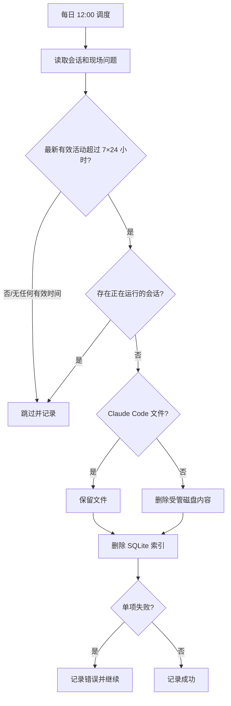

# 内容自动清理流程

## 保留规则

- 调度时间：服务器本地时间每天 12:00。
- 服务在 12:00 之后启动时立即补跑当天任务，然后等待下一天 12:00。
- 截止时间：当前时间减去 7×24 小时；只有最后活动时间早于截止时间的记录才进入清理。
- 聊天会话使用 `sessions.updated_at`。现场问题使用数据库时间、关联会话时间和问题目录内最新文件修改时间中的最大值。
- 聊天会话正在运行时跳过；现场问题只在存在正在运行的关联会话时跳过，`analyzing` 状态本身不再阻止过期清理。
- 现场问题的数据库时间为空或无法解析时回退到磁盘修改时间，避免坏索引永久阻止磁盘清理。

## 清理范围

- 聊天会话索引：清理 Claude、Cursor、Codex、Gemini 的 SQLite 会话索引。
- Claude Code：递归保护整个 `~/.claude/`，不删除其文件；过期数据库索引仍删除。
- Cursor、Codex、Gemini：删除被索引的会话产物后再删除 SQLite 索引。
- 现场分析：递归删除 `ONSITE_ROOT` 下超过保留期的问题目录及其中全部文件，再删除关联数据库记录；子表通过外键级联删除，内存消息缓存同步清除。
- 日期前缀符合 `YYYYMMDD-...` 或 `YYYYMMDDHHMMSS-...` 的磁盘孤儿问题目录也参与清理。
- `ONSITE_ROOT` 根目录文件、隐藏目录和非日期业务目录不参与清理，例如 `CLAUDE.md`、`.git`、`.skills`、`.worktrees` 和 `untitled`。
- OpenCode 不在本项目使用范围内，完全跳过。
- 项目索引、账号、凭据、API Key、应用配置和通知订阅不参与清理。

## 执行流程

磁盘删除与索引删除无法跨文件系统事务原子化，因此采用磁盘优先顺序。磁盘删除失败时保留索引，磁盘删除成功但索引删除失败时记录错误并在下一次任务重试。
