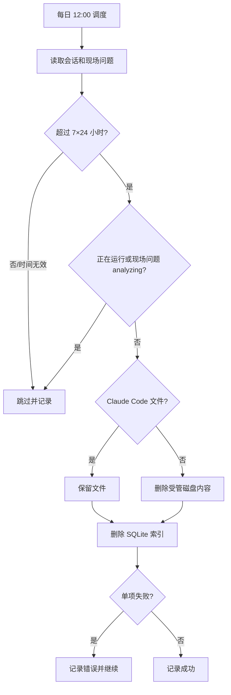

# 内容自动清理流程

## 保留规则

- 调度时间：服务器本地时间每天 12:00。
- 服务在 12:00 之后启动时立即补跑当天任务，然后等待下一天 12:00。
- 截止时间：当前时间减去 7×24 小时；只有最后活动时间早于截止时间的记录才进入清理。
- 聊天会话使用 `sessions.updated_at`，现场问题使用 `onsite_problems.updated_at`。
- 时间为空或无法解析、正在运行的聊天会话、状态为 `analyzing` 的现场问题均跳过，并在下次任务重试。

## 清理范围

- 聊天会话索引：清理 Claude、Cursor、Codex、Gemini 的 SQLite 会话索引。
- Claude Code：递归保护整个 `~/.claude/`，不删除其文件；过期数据库索引仍删除。
- Cursor、Codex、Gemini：删除被索引的会话产物后再删除 SQLite 索引。
- 现场分析：删除 `ONSITE_ROOT` 下的问题目录及关联数据库记录；子表通过外键级联删除，内存消息缓存同步清除。
- OpenCode 不在本项目使用范围内，完全跳过。
- 项目索引、账号、凭据、API Key、应用配置和通知订阅不参与清理。

## 执行流程

磁盘删除与索引删除无法跨文件系统事务原子化，因此采用磁盘优先顺序。磁盘删除失败时保留索引，磁盘删除成功但索引删除失败时记录错误并在下一次任务重试。
